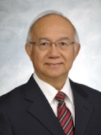
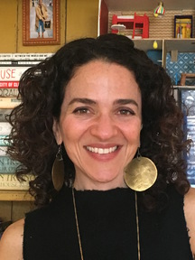

**The MIT App Inventor Summit** is a gathering of the world-wide
App Inventor community. Hosted by the MIT Computer Science and Artificial Intelligence Laboratory
(CSAIL), the summit brings together a diverse range of individuals,
including:
- research scientists;
- educators from formal and informal settings;
- NGO staff members;
- computer scientists;
- representatives from industry;
- entrepreneurs;
- and others.
The intimate size, exhilarating program, and accomplished attendees make the MIT App Inventor Summit
an ideal opportunity to share current work, form new collaborations,
and stay abreast of the latest developments within the MIT App
Inventor community.

**This year's summit will include:**
- Youth Mobile Power Awards
- Keynote Speakers
- Panel discussions with the original
development team as well as current team members
- Presentations by students, teachers, and professional app developers
- Poster session
- Mini-hackathon
- Networking reception

__[Click here to download a PDF version of the program](/assets/images/program.pdf)__

## Youth Mobile Power Programming Competition

A highlight of the summit will be the official recognition of the winners of the Youth Mobile
Power, MIT App Inventor challenge, run by MIT and YR Media.

***[Learn more about participating in the Youth Mobile Power App
Challenge](http://appinventor.mit.edu/explore/youth-mobile-power-app-challenge.html
)***.

## Keynote Speakers

**Daniel Lai, Program Director, CoolThink @ JC**

Daniel is the Program Director of Coolthink@JC - a Computational Thinking and Coding Education Program for primary school students in Hong Kong.  The program is being funded by Hong Kong Jockey Club Charities Trust (“JCCT”), and co-created by JCCT, Massachusetts Institute of Technology, Education University of Hong Kong, and City University of Hong Kong. The aim of the program is to inspire digital creativity of students in this digital age. Since its launch in 2016, Coolthink@JC has trained 110 teachers and is being run in classes in 32 schools for 16,000 students.

Daniel was Vice-President (Administration) and Professor of Practice (Computing) of Hong Kong Polytechnic University from 2015-2017, Government Chief Information Officer of Hong Kong SAR Government from January 2012 to January 2015; Head of Information Technology of MTR Corporation Ltd. from 1999 to 2011, and held senior IT managerial positions at The Hong Kong Jockey Club (HKJC) in Hong Kong and Australia between 1978 and 1999.

Daniel is a seasoned information technology professional with 50 years’ experience. He is a graduate of Hong Kong Polytechnic University and Griffith University, with a Master in Technology Management. He is a Distinguished Fellow and Past President of Hong Kong Computer Society, Founding Chairman of CIO Board, and a Fellow of Hong Kong Institute of Engineers. 

Daniel contributed significantly in promoting the development and application of IT in Hong Kong and the region. In recognition of his contribution to the development and promotion of IT, he was awarded Bronze Bauhinia Star (BBS) by the Hong Kong Government in 2004. Daniel has received many CIO Awards including Computerworld Laureate, Top China CIO Award, ZDNet CIO of the Year, and IDC Asia CIO of the Year etc. 

**Lissa Soep, YR Media**

Elisabeth (Lissa) Soep is Executive Producer for Journalism and Founding Director of the Innovation Lab at YR Media (formerly Youth Radio), the Oakland-based national network for next-generation news and arts. YR stories Lissa has produced with teen reporters have been recognized with honors including two Peabody Awards, five Murrow Awards, an Investigative Reporters and Editors Award, two Third Coast International Audio Festival Awards, and the Robert F. Kennedy Journalism Award. With a PhD from Stanford University’s School of Education, Lissa has written about digital media and learning for academic journals, popular outlets (NPR, Boing Boing), and books including Youthscapes (with Maira, UPenn Press), Drop that Knowledge (with Chávez, UC Press), and Participatory Politics (MIT Press). With Asha Richardson, she founded YR’s Innovation Lab, a partnership with MIT and Cornell Tech that was among the first community-based initiatives in the US to teach teens to code, and the first embedded in a newsroom. Her work as a writer, producer, and editor has been featured on NPR, the New York Times, The Atlantic/CityLab, and Teen Vogue. In 2011, she became one of six members of the MacArthur Foundation’s Youth and Participatory Politics Research Network, which explored how young people use digital and social media to express civic voice and agency. For more than ten years, Lissa served on the Board of Directors of the United States’ premier youth poetry organization, Youth Speaks.

## Panels

### Meet the Original App Inventor Team

Meet the team that started it all. Members of the original App Inventor team will talk about the beginning days of App Inventor and share their thoughts on computer science education in the 10 years since the debut of App Inventor.

For more details about the Original App Inventor Team panel, please see [the announcement](2019/05/20/announcing-google-team-panel.html).

### Sneak Peek at Upcoming Features with the Development Team

Lead Developer Evan Patton will demonstrate upcoming features for MIT App Inventor. Afterward, he will be joined by development team members Susan Lane and Jeffrey Schiller for a round table discussion with attendees about App Inventor development.

### Education Panel: Pedagogy with MIT App Inventor

Karen Lang and Selim Tezel will participate in a discussion about curriculum development at MIT.

## Other Highlights

### Poster Session

Present your latest App Inventor work at the poster session overlooking the beauitful Charles River and Boston, MA. Exchange ideas with your fellow app inventors and get inspired to build the next great app!

### Reception

The first night of the summit will include a reception for all participants to relax and mingle with with App Inventor team.

## Sponsorship

If you or your organization is interested in sponsoring the summit, please send an email to [summit-2019@appinventor.mit.edu](mailto:summit-2019@appinventor.mit.edu?subject=Summit sponsorship) to make arrangements.
